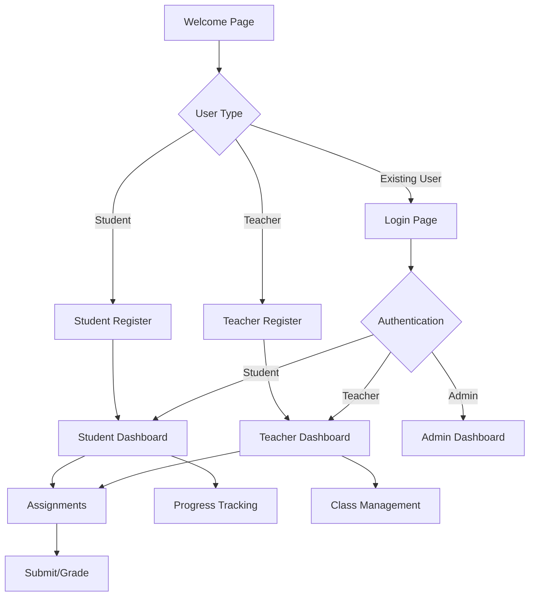

## 1. Product Overview
EduTracker is an educational tracking platform that helps students and educators monitor learning progress. The platform provides tools for tracking assignments, grades, and study habits.

The product targets students, teachers, and educational institutions looking for a modern, responsive web application to manage educational workflows effectively.

## 2. Core Features

### 2.1 User Roles
| Role | Registration Method | Core Permissions |
|------|---------------------|------------------|
| Student | Email registration | View assignments, submit work, track progress |
| Teacher | Admin invitation | Create assignments, grade work, manage classes |
| Admin | System setup | Full platform management, user management |

### 2.2 Feature Module
Our educational tracking platform consists of the following main pages:
1. **Welcome page**: Figma-based landing page with product overview and call-to-action.
2. **Dashboard page**: Student/teacher overview with assignments, grades, and progress tracking.
3. **Assignments page**: Assignment management, submission, and grading interface.
4. **Profile page**: User settings, preferences, and account management.
5. **Login/Register pages**: Authentication and user onboarding.

### 2.3 Page Details
| Page Name | Module Name | Feature description |
|-----------|-------------|---------------------|
| Welcome page | Hero section | Display product value proposition with animated Figma-designed graphics. |
| Welcome page | Features showcase | Highlight key platform benefits for students and teachers. |
| Welcome page | CTA section | Direct users to register or login with clear action buttons. |
| Dashboard page | Overview cards | Show current assignments, upcoming deadlines, and recent grades. |
| Dashboard page | Progress charts | Visualize learning progress with interactive charts. |
| Dashboard page | Quick actions | Provide shortcuts to common tasks like submitting assignments. |
| Assignments page | Assignment list | Display all assignments with filtering and sorting options. |
| Assignments page | Submission interface | Allow students to upload and submit their work. |
| Assignments page | Grading tools | Enable teachers to review and grade submissions. |
| Profile page | User information | Display and edit personal information and preferences. |
| Profile page | Account settings | Manage notification preferences and privacy settings. |
| Login page | Authentication form | Secure login with email/password or social auth. |
| Register page | Registration form | New user signup with email verification. |

## 3. Core Process
**Student Flow**: Welcome Page → Register → Dashboard → View Assignments → Submit Work → Track Progress

**Teacher Flow**: Welcome Page → Register → Dashboard → Create Assignments → Grade Submissions → Monitor Class Progress

**Admin Flow**: Welcome Page → Login → Admin Dashboard → Manage Users → Configure Platform Settings

## 4. User Interface Design

### 4.1 Design Style
- **Primary colors**: Blue (#3B82F6) for primary actions, Green (#10B981) for success states
- **Secondary colors**: Gray (#6B7280) for text, Light Gray (#F3F4F6) for backgrounds
- **Button style**: Rounded corners (8px radius), subtle shadows on hover
- **Font**: Inter font family with responsive sizing (14px base, 16px for headings)
- **Layout**: Card-based design with consistent spacing (8px grid system)
- **Icons**: Heroicons for consistency, emojis sparingly for engagement

### 4.2 Page Design Overview
| Page Name | Module Name | UI Elements |
|-----------|-------------|-------------|
| Welcome page | Hero section | Full-width gradient background, animated product illustration, large heading with 48px font size. |
| Welcome page | Features showcase | Three-column grid layout, icon-based feature cards with hover animations. |
| Dashboard page | Overview cards | White cards with subtle borders, progress indicators with circular charts. |
| Assignments page | Assignment list | Table layout with alternating row colors, status badges with color coding. |
| Profile page | User information | Form layout with labeled input fields, avatar upload with preview. |

### 4.3 Responsiveness
The product follows a desktop-first design approach with mobile responsiveness:
- Breakpoints: 640px (mobile), 768px (tablet), 1024px (desktop)
- Touch-optimized interactions for mobile devices
- Collapsible navigation menu for smaller screens
- Responsive grid layouts that adapt to screen size