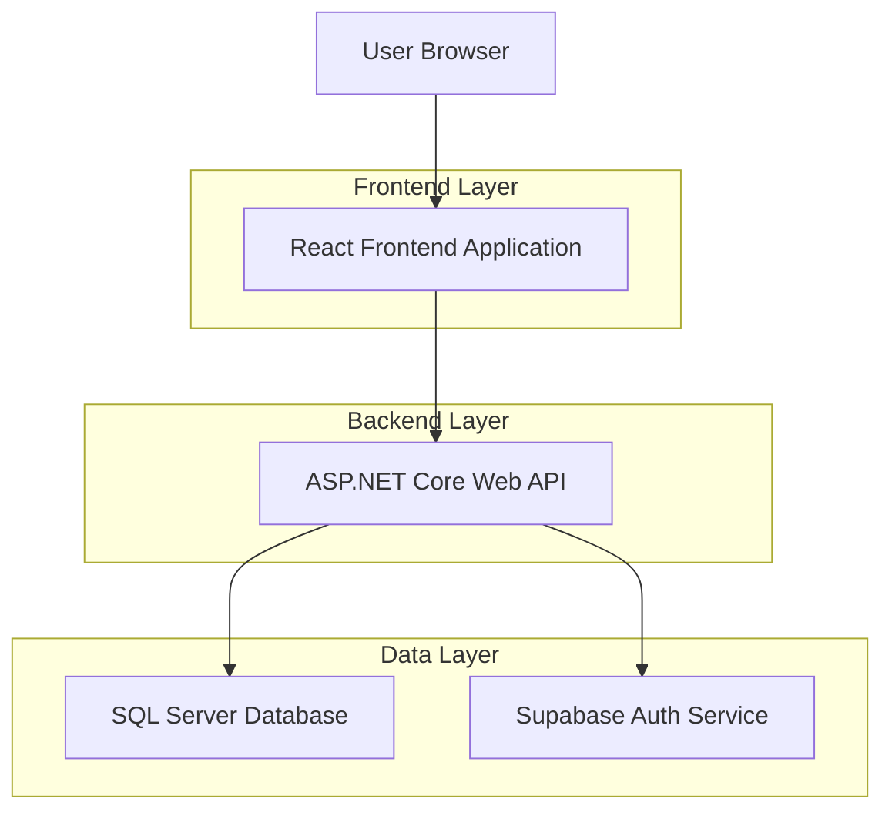
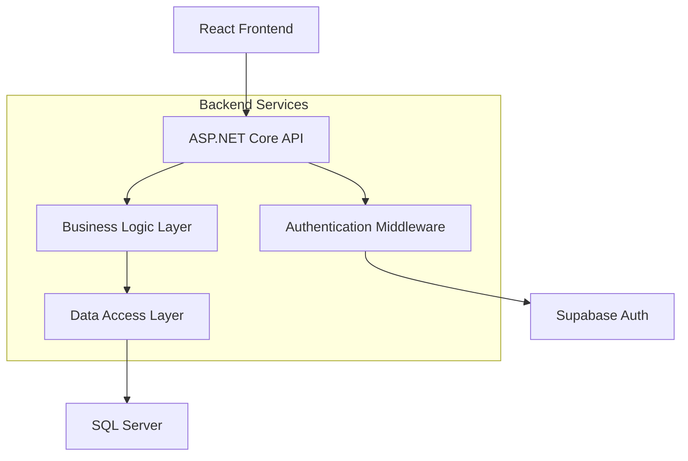
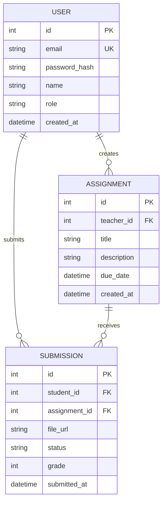

## 1. Architecture design



## 2. Technology Description
- Frontend: React@18 + TypeScript@5 + TailwindCSS@3 + Vite
- Initialization Tool: vite-init
- Backend: ASP.NET Core@6 (existing, unchanged)
- Database: SQL Server (existing, unchanged)
- Authentication: Supabase Auth (replacing Flutter auth)
- State Management: React Context + useReducer
- Routing: React Router@6
- HTTP Client: Axios

## 3. Route definitions
| Route | Purpose |
|-------|---------|
| / | Welcome page with Figma-designed landing |
| /login | User authentication page |
| /register | New user registration page |
| /dashboard | Main dashboard for students and teachers |
| /assignments | Assignment management and submission |
| /profile | User profile and settings |
| /admin | Admin dashboard (admin users only) |

## 4. API definitions

### 4.1 Authentication API
```
POST /api/auth/login
```

Request:
| Param Name| Param Type  | isRequired  | Description |
|-----------|-------------|-------------|-------------|
| email     | string      | true        | User email address |
| password  | string      | true        | User password |

Response:
| Param Name| Param Type  | Description |
|-----------|-------------|-------------|
| token     | string      | JWT authentication token |
| user      | object      | User profile data |

### 4.2 Assignments API
```
GET /api/assignments
```

Response:
| Param Name| Param Type  | Description |
|-----------|-------------|-------------|
| assignments | array     | List of assignment objects |
| total     | number      | Total assignment count |

### 4.3 Submission API
```
POST /api/assignments/{id}/submit
```

Request:
| Param Name| Param Type  | isRequired  | Description |
|-----------|-------------|-------------|-------------|
| file      | file        | true        | Assignment submission file |
| comments  | string      | false       | Optional submission comments |

## 5. Server architecture diagram


## 6. Data model

### 6.1 Data model definition


### 6.2 Frontend Component Structure
```
src/
├── components/
│   ├── common/
│   │   ├── Button.tsx
│   │   ├── Card.tsx
│   │   └── Header.tsx
│   ├── auth/
│   │   ├── LoginForm.tsx
│   │   └── RegisterForm.tsx
│   ├── dashboard/
│   │   ├── DashboardOverview.tsx
│   │   └── ProgressChart.tsx
│   └── assignments/
│       ├── AssignmentList.tsx
│       └── SubmissionForm.tsx
├── pages/
│   ├── Welcome.tsx
│   ├── Login.tsx
│   ├── Dashboard.tsx
│   └── Assignments.tsx
├── hooks/
│   ├── useAuth.ts
│   └── useApi.ts
├── services/
│   ├── auth.service.ts
│   └── api.service.ts
└── types/
    ├── user.types.ts
    └── assignment.types.ts
```

## 7. Migration Strategy

### 7.1 Flutter Cleanup
- Remove all Flutter-related files and directories
- Delete mobile/flutter directory and contents
- Remove Flutter-specific configuration files
- Update .gitignore to exclude Flutter artifacts

### 7.2 React Setup
- Initialize new React project with TypeScript template
- Configure TailwindCSS for styling
- Set up React Router for navigation
- Implement authentication with Supabase
- Create reusable component library

### 7.3 Backend Integration
- Maintain existing ASP.NET Core API endpoints
-